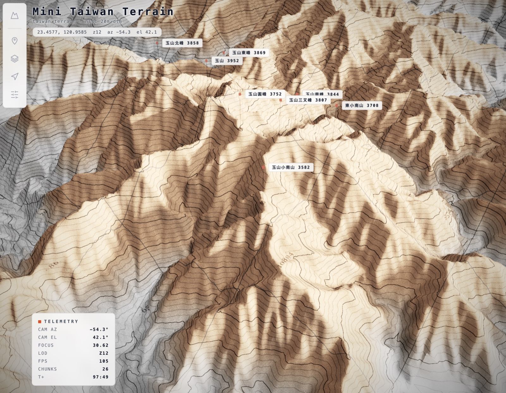
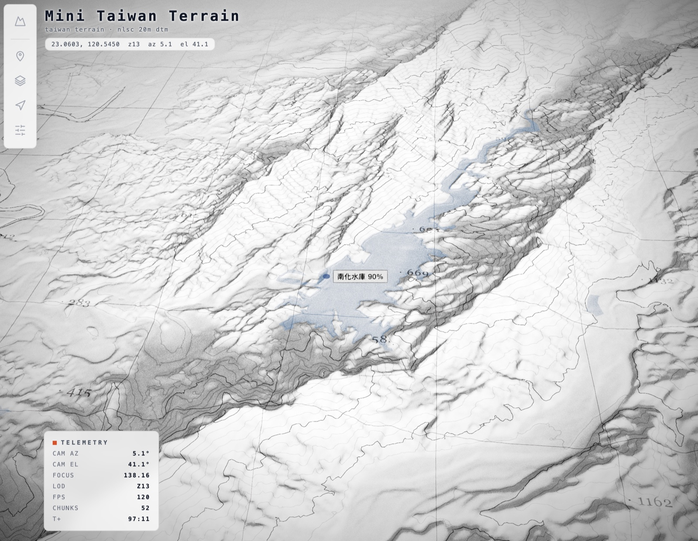

# Terrain Art — 台灣 3D 地形視覺化

台灣版的互動 3D 地形圖：復古 USGS 地形圖紙質感 + FUI 掃描介面，載入**台灣真實高程**（玉山、雪山、大霸尖山、太魯閣…8 個 preset，或自訂經緯度），以等高線、分層設色、測量網格、真實山峰 POI 與電影式飛覽探索。在此基礎上疊了一整套可切換的 **GIS 圖層**（鐵路 / 車站 / 河川 / 水庫 / 周邊地圖）與一顆**程序化颱風**。

> Fork 自 **[kaolti/monolith-terrain](https://github.com/kaolti/monolith-terrain)**（MIT）。高程資料源由原本的 AWS Terrain Tiles 換成自家 **NLSC 20m DTM** 圖磚，並加上真實山峰標註、台灣 preset、以及下列的圖層與颱風系統。詳見 [授權與致謝](#授權與致謝)。

## 展示



*玉山群峰（NLSC 20m DTM，z12）— 分層設色、等高線、測量網格與真實山峰標註的復古地形圖美術。*



*南化水庫（z13）— 水庫圖層以即時蓄水率呈現水面（「南化水庫 90%」，取自 Supabase 即時 RPC）。*

## 功能

- **真實地形**：8 個台灣名山 preset 或自訂經緯度；單一串流世界，chunk 隨鏡頭增量載入（LOD 分層 z10–z13）。
- **地形圖美術**：等高線、分層設色 hypsometric ramp、坡度著色、測量網格、紙質後製（曝光/對比/飽和/暗角/顆粒/景深）。
- **山峰 POI**：即時搜尋鏡頭周邊真實山峰，點擊飛入 + 資料卡。
- **電影式飛覽 Tour**：point-to-point / orbit / contour 三種模式。
- **雷達掃描**：從鏡頭中心擴散的掃描漣漪特效。
- **GIS 圖層系統**：統一的 `LayerManager` + manifest 延遲載入，每個圖層一個面板區塊、可即時調樣式（見下）。
- **效能**：on-demand render（靜止時 GPU 停擺、idle 時以原生 DPR 出一張 Retina 靜幀），只有動畫/互動才持續渲染。

### 圖層

| 圖層 | 內容 | 資料 / 做法 |
|------|------|-------------|
| 海岸線 Coastline | 本島海平面外框 | `coastline_taiwan.json`（單一封閉環）|
| 縣市界 Counties | 內部縣市界（貼合地形稜線）| `counties_internal_borders.json` |
| 鐵路 Rail | 台鐵/捷運/輕軌等，各線官方色 | GeoJSON 烘焙高程（`bake_layer_elevations.py`）|
| 車站 Stations | 各運輸系統站點（含高鐵）| 同上，一系統一 marker set |
| 河川 Rivers | 河名標籤 + 河面水體 sheet | `rivers.json`（標籤）+ `river_surfaces.json`（水面）|
| 河川模擬 River Sim | 全島物理衍生河道，染色貼進地形 shader | DEM 流量累積（`bake_flow_accum.py` → `river_sim.png`）|
| 水庫 Reservoirs | 水庫水面 + 壩體，**即時蓄水率** | 烘焙盆地 + Supabase 即時 RPC |
| 周邊 Region | 周邊海岸線描邊 + 海色平面 | Natural Earth 10m + 陸海遮罩（見下）|
| 颱風 Typhoon | 程序化 3D 渦旋雲層 | 純 shader，無資料（見下）|

### 颱風 Typhoon（`src/engine/typhoon.js`）

純程序化、無資料的渦旋雲層，做成**位移網格**而非平面貼圖：

- 低頻風暴場位移頂點 → 真 3D 立體（眼牆聳立、風眼下凹），高度場法線接場景太陽打光。
- 對數螺旋雨帶（帶間透空見海）、中心密蔽雲區 CDO、各向異性 ridged 絲狀切變、波數-1 不對稱 + 逗號尾、外圍卷雲薄紗。
- 面板可調：密度 / 立體 Relief / 旋轉 / 風眼 / 不透明度 / 眼經緯度 / 雲色。
- 白雲搭配較暗或海洋色的 `fogColor` 最有衛星既視感。

### 周邊地圖 Region（`src/engine/region.js`）

台灣 DEM 圖磚只覆蓋本島 bbox；此圖層補上周邊地理定位：

- 周邊海岸線折線（台灣離島 / 菲律賓北部 / 琉球 / 日本南部 / 韓國南部 / 中國東南沿海），來源 **Natural Earth 1:10m**（公有領域），裁切 + Douglas–Peucker 簡化（`bake_region_coast.py`）。
- 一片海色平面填海。**陸海以遮罩切割**（依海岸線而非海拔，低地平原不會被淹）：用台灣海岸線 ring 烘的 land/sea 遮罩當 `alphaMap`（`bake_region_sea_mask.py`）；`polygonOffset` 解決與 DEM 海面的 z-fighting。

## 資料來源

| 資料 | 來源 | 授權 |
|------|------|------|
| 高程 DTM | 內政部國土測繪中心（NLSC）20m 網格 DTM，2024 | [政府資料開放授權條款](https://data.gov.tw/license) |
| 鐵路 / 站名 | taipei-gis-analytics（自家 GIS 專案）| — |
| 車站 / 高鐵 / 水庫即時值 | mini-taiwan-pulse（自家專案，Supabase）| — |
| 周邊海岸線 | [Natural Earth](https://www.naturalearthdata.com/) 1:10m coastline | 公有領域（Public Domain）|
| 山峰 | `src/engine/data/peaks.json` / `public/data/taiwan_peaks.geojson` | — |

高程已重編碼為 terrarium RGB PNG XYZ 圖磚（z10–13，`meters = R*256 + G + B/256 - 32768`；純海域 tile 不產生，缺 tile 視為海平面 0 m）。

## 圖磚接線

圖磚不進 git（`public/tiles` 已 ignore）。兩種接法：

```bash
# A. symlink 到本機圖磚目錄（開發用）
ln -s /path/to/taipei-gis-analytics/data/processed/base_map/terrain_rgb/tiles public/tiles

# B. 環境變數指到任一 tile server / CDN（例如 Cloudflare R2）
VITE_TILE_BASE=https://tiles.example.com npm run dev
```

未設 `VITE_TILE_BASE` 時預設抓 `/tiles/{z}/{x}/{y}.png`。

## 開發

```bash
npm install
npm run dev     # http://localhost:5173
npm run build   # 靜態產物在 dist/
```

開發者模式（lil-gui 全參數面板）：`http://localhost:5173/?debug=1`。主控台可用 `window.__exp`（DEV）取得引擎 debug 介面。

### 烘焙腳本（`scripts/`，需 Python3 + numpy/PIL/scipy）

離線把各圖層資料處理成引擎可延遲載入的精簡 JSON / PNG（產物放 `public/layers/`）：

| 腳本 | 產物 |
|------|------|
| `bake_layer_elevations.py` | `rail_lines.json`、`stations.json` |
| `bake_flow_accum.py` / `pilot_flow_accum.py` | `river_sim.png` + `.json`（+ pilot 版）|
| `bake_region_coast.py` | `region_coast.json` |
| `bake_region_sea_mask.py` | `region_sea_mask.png` + `.json` |

## 操作

| 動作 | 方式 |
|---|---|
| 環視 | 拖曳旋轉、滾輪縮放、右鍵平移、WASD/方向鍵平移 |
| 看某座山 | 點山峰標籤（真名 + 海拔）— 鏡頭飛入並開啟資料卡 |
| 圖層開關 | 左側 **Layers** 面板逐層開關 + 樣式滑桿 |
| 電影式飛覽 | **Tour** 面板選 from / to + 模式，按 **▶ start tour** |
| 換地點 | **Terrain source → location** 選 preset，或 Custom + 經緯度後 **load location** |
| 雷達掃描 | **HUD → trigger scan** |

## 部署

`npm run build` 產出 `dist/` 靜態網站，部署於 **Zeabur**；build 時以環境變數 `VITE_TILE_BASE=https://tiles.itsmigu.com` 指向圖磚 CDN。

地形圖磚（~292 MB, z10–13）託管於 **Cloudflare R2**（Custom Domain `tiles.itsmigu.com`，CORS 開放 GET/HEAD），走 Cloudflare CDN、egress 免費。改圖磚後重新同步到 R2；改 `VITE_TILE_BASE` 後需 Zeabur redeploy（build-time 變數）。

> repo 內另有 `.github/workflows/deploy.yml`（GitHub Pages）與 `wrangler.jsonc`（Cloudflare）作為備選；目前線上以 **Zeabur** 為準（Pages workflow 未注入 `VITE_TILE_BASE`，其產物不含圖磚）。

## 授權與致謝

本專案的**程式碼** fork 自 **[kaolti/monolith-terrain](https://github.com/kaolti/monolith-terrain)**，採 **[MIT](LICENSE)** 授權；`LICENSE` 保留原作者（kaolti）之版權聲明，符合 MIT 對衍生作品的署名要求。台灣化改造、GIS 圖層系統、颱風與周邊地圖為本專案新增。

資料方面請一併遵循各來源授權：NLSC DTM（政府資料開放授權條款）、Natural Earth（公有領域）。原上游對其 AWS Terrain Tiles 高程資料的致謝，因本專案已改用 NLSC 資料而不再適用。

## License

[MIT](LICENSE) — 沿用上游 kaolti/monolith-terrain 之授權，`LICENSE` 檔保留原作者版權聲明。
